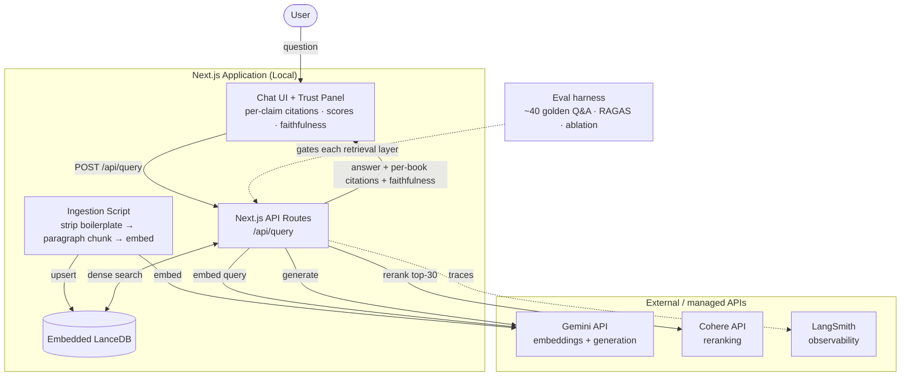

# Architecture — recall

Source of truth for the system design. Written to be handed to Claude Code and
to back every README claim with a defensible rationale.

---

## 1. Product thesis

`recall` answers questions by **synthesising grounded, cited responses across a
personal library of books**. Three non-negotiable properties:

1. **Grounded** — answers are built only from retrieved passages, never the
   model's parametric memory.
2. **Cited** — every claim is attributed to the book and passage it came from.
3. **Honest** — it refuses ("your library doesn't cover this") when retrieval
   surfaces no real support, and flags where sources disagree.

The differentiation is **visible, synthesised trust**: a capable LLM already
knows these public-domain classics, so the value is proving the answer is drawn
from *this corpus* (by showing the passages) and merging several books into one
attributed answer — something a bare chatbot can't convincingly do.

---

## 2. Scope

**In (MVP)**
- A curated, single-domain library of **plain-text** books (multiple books).
- Paragraph-aware chunking.
- Pure dense retrieval → rerank → **cross-book synthesis** with
  per-claim citations and refusal.
- Golden-set evaluation with RAGAS-style metrics + an ablation table.
- LangSmith tracing for zero-boilerplate observability.
- Local run only via a monolithic Next.js application using embedded LanceDB.

**Out (deferred — stated deliberately)**
- **Whole-idea context expansion** (parent-section / neighbour-window retrieval).
  MVP chunks are sized to read as complete ideas; the schema keeps `chunk_index`
  ordering so expansion is a trivial add (see §11).
- **EPUB / PDF** ingestion (plain text only for now).
- **Multi-domain / very large** corpora and per-book filtering UI.
- Auth, multi-user, streaming, caching.
- Hybrid/Lexical search (Pure dense with modern embeddings captures semantic intent perfectly without the complexity of FTS).

**A KISS note on multi-book.** Supporting many books is *not* deferred, because
it costs almost nothing here (the embedded database + `documents` table + `chunks.document_id` FK
already model it, and retrieval spans all chunks by default) and it is the whole
point of the product. What we simplify instead is the genuinely complex part:
one input format and a coherent single-domain corpus, rather than a large mixed
pile that would muddy retrieval.

---

## 3. System components

---

## 4. Data flow

### 4.1 Ingestion (offline, run once per library)

1. **Load** each `.txt` file from `./corpus`.
2. **Strip Project Gutenberg boilerplate** — keep only the text between
   `*** START OF THE PROJECT GUTENBERG EBOOK ***` and `*** END ... ***`.
3. **Detect metadata** (title/author) from the header or a sidecar mapping; if a
   chapter/section heading is detectable, record it as `section_title`.
4. **Chunk paragraph-aware**: pack whole paragraphs (double-newline separated)
   up to ~500 tokens, ~15% overlap, never splitting a paragraph. Each chunk
   records `document_id`, `section_title`, `chunk_index`, `token_count`.
5. **Embed** with `gemini-embedding-2`, task type `RETRIEVAL_DOCUMENT`, 768
   dims (Matryoshka representation ensures minimal quality loss).
6. **Upsert** into the local embedded LanceDB database.

Ingestion is a script (`npm run ingest`), never on the request path. Due to using the Gemini Free Tier, ingestion must implement strong rate-limiting logic (e.g., exponential backoff, pauses between batches) to prevent and gracefully handle API rate limit (429) errors.

### 4.2 Query (request path)

1. **Embed the query** (`gemini-embedding-2`, `RETRIEVAL_QUERY` task type).
2. **Retrieve** via Dense Search on LanceDB returning ~30 candidates joined with book
   title/author. 
3. **Rerank** with Cohere Rerank API; keep ~6 passages — enough material
   from potentially several books to synthesise across.
4. **Synthesise** with `gemini-3-flash` (default temperature): merge complementary points
   into one answer, attribute each to its book, note disagreements, and refuse
   if the passages don't address the question.
5. **Respond** with the answer, per-claim citations (book + passage), the
   retrieved passages + scores, and a faithfulness signal — the trust-panel
   payload.

Every stage automatically emits a trace to LangSmith.

---

## 5. Retrieval pipeline (the core)

Retrieval, not generation, is where RAG fails most — so effort concentrates here.

**Pure Dense Search.** Conceptual questions ("how do I motivate
myself?") rarely share vocabulary with the source wording ("discipline," "the
will," "assent," "habit"). Semantic embeddings bridge that gap. With modern, high-quality embedding models like `gemini-embedding-2`, dense search captures semantic intent and exact phrasing well enough that maintaining a complex Lexical/Full-Text Search (FTS) index is unnecessary. This significantly reduces architectural complexity (no Postgres FTS, no Reciprocal Rank Fusion algorithms). Studies and case studies repeatedly show that strong embedding models alone cover 95%+ of queries in pure prose and conceptual texts without needing sparse rescue mechanisms.

**Reranking for Future Scaling.** A cross-encoder scores each (query, passage) pair
jointly — exactly the semantic-relevance discrimination prose needs. While **Pure Dense Retrieval** (Top-6 directly from LanceDB via `gemini-embedding-2`) is sufficient and highly performant for this MVP, a dedicated Reranker (like Cohere) remains in scope for future expansion. When the corpus grows significantly and passages begin to heavily overlap, a "retrieve broad (top-30), rerank precise (top-6)" pipeline yields the highest ROI for answer quality. The `COHERE_API_KEY` is retained in `.env` for this exact future use case.

**Built in layers, gated by eval.** Implement `dense-only → +rerank`,
recording metrics at each step (see §8). If a layer doesn't move the numbers, it
gets cut — and that decision is the signal.

Config knobs: `RERANK_ENABLED`, `RERANK_CANDIDATES`, `RERANK_TOP_K`, `RELEVANCE_FLOOR`.

---

## 6. Chunking strategy

The highest-leverage decision, treated as a real algorithm:

- **Paragraph-aware**: split on double-newline boundaries; pack whole paragraphs
  up to ~500 tokens with ~15% overlap. Never split mid-paragraph.
- **Idea-complete by design**: chunks are sized so each already reads as a
  coherent thought — the MVP's answer to "understand the idea in full context,"
  without yet building context expansion.
- **Ordered**: `chunk_index` per document is preserved so neighbour-window
  expansion (v2) is a trivial add.
- **Clean input**: Gutenberg license boilerplate stripped before chunking.

Tune target size and overlap against the golden set, not by assumption.

---

## 7. Model choices

### 7.1 Embeddings — `gemini-embedding-2` @ 768 dims
- Google's latest embedding model, topping MTEB leaderboards, faster and cheaper.
- **768 dims** natively supported via Matryoshka representation learning. Truncating to 768 dimensions retains almost all retrieval quality while keeping the local vector database extremely small and fast.
- **Asymmetric task types**: docs `RETRIEVAL_DOCUMENT`, queries
  `RETRIEVAL_QUERY`.

### 7.2 Generation — `gemini-3-flash` @ default temp
- The job is faithful **synthesis** across passages + attribution + refusal, not
  frontier reasoning — Flash tier is the sweet spot; Pro's 2M context solves a
  problem we don't have.
- Use default temperature for fluent multi-source prose while maintaining grounding.
- **Flash-Lite** as a measured downgrade experiment via the eval harness.

### 7.3 Reranker — `Cohere Rerank API`
- Shifting from local PyTorch `sentence-transformers` to Cohere's API drastically reduces the footprint of the application. It prevents bloating the node modules and ensures rapid cold-starts, while matching or beating local cross-encoder quality.

### 7.4 Judge (eval) — `gemini-3-flash`
- Same model as generation → one key, consistent judge bias across ablations.

---

## 8. Evaluation

- **Golden set** (`eval/golden.jsonl`): ~30–50 question / expected-answer /
  expected-source triples over the corpus. Include **cross-book** questions
  (whose answer should draw on ≥2 books) to exercise synthesis, plus a few
  **off-corpus** questions that *should* trigger refusal.
- **Metrics (RAGAS-style)**: faithfulness, answer relevancy, context precision,
  context recall. Aim: faithfulness > 0.9, answer relevancy > 0.85.
- **Ablation table** — the headline artifact:

  | Pipeline | context precision | faithfulness | answer relevancy |
  |---|---|---|---|
  | dense only | … | … | … |
  | + rerank | … | … | … |

- **Run it first**, before feature polish, so every tuning choice is measured.

---

## 9. Observability & guardrails

**Tracing.** LangSmith replaces manual OpenTelemetry spans. A simple AI SDK / LangChain wrapper intercepts all API calls, tracing retrieval latencies, generation costs, and inputs/outputs automatically.

**Guardrails.** (See [`SAFETY_AND_PRECISION.md`](./SAFETY_AND_PRECISION.md) for full details on anti-injection and anti-hallucination mechanisms)
- Grounded-only synthesis prompt: answer solely from provided passages.
- **Per-claim citation** tied to `(book, chunk)`.
- **Refusal** below a relevance floor — "your library doesn't cover this" rather
  than answering from the model's own memory.
- **Disagreement surfacing**: when sources conflict, say so instead of
  flattening.

---

## 10. Key decisions & trade-offs

| Decision | Chosen | Rejected | Rationale |
|---|---|---|---|
| Architecture | **Next.js Monolith** | Python Backend + Next.js + DB | Removing FastAPI/Docker simplifies local setup to `npm install` for reviewers. |
| Vector DB | **LanceDB (Embedded)** | Supabase / Postgres | Zero infrastructure setup. The DB runs in-memory/file-system, ideal for take-homes. |
| Retrieval | **Pure Dense (MVP)** | Hybrid (Dense + FTS) | `gemini-embedding-2` captures semantics perfectly. Dropping FTS removes immense SQL complexity. |
| Reranker | **None (MVP)** | Local `sentence-transformers` / Cohere API | Deferred to v2. Pure dense handles the MVP well. Cohere remains in scope for future large-corpus scaling. |
| Embeddings | `gemini-embedding-2` | `gemini-embedding-001` | Faster, cheaper, higher MTEB, and native 768-dim truncation without quality loss. |

---

## 11. Deferred (v2 roadmap)

- **Whole-idea context expansion**: post-rerank, fetch `chunk_index ± N` from the
  same document and stitch — the schema already orders chunks for this.
- **EPUB / PDF** ingestion.
- **Multi-domain libraries** + per-book/-domain filtering.
- **Streaming** synthesis; Gemini **context caching** for the system prompt.
- **Multilingual evaluation** (capability already present).
