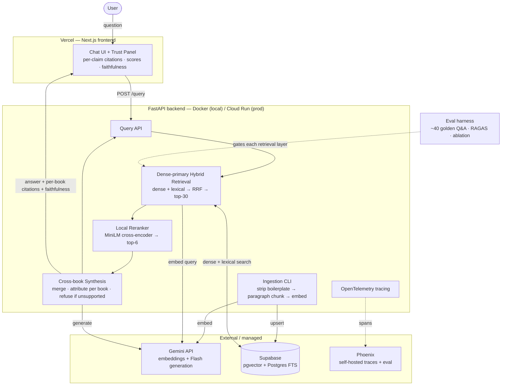

# Architecture — recall

Source of truth for the system design. Written to be handed to Claude Code and
to back every README claim with a defensible rationale.

---

## 1. Product thesis

`recall` answers questions by **synthesising grounded, cited responses across a
personal library of books**. Three non-negotiable properties:

1. **Grounded** — answers are built only from retrieved passages, never the
   model's parametric memory.
2. **Cited** — every claim is attributed to the book and passage it came from.
3. **Honest** — it refuses ("your library doesn't cover this") when retrieval
   surfaces no real support, and flags where sources disagree.

The differentiation is **visible, synthesised trust**: a capable LLM already
knows these public-domain classics, so the value is proving the answer is drawn
from *this corpus* (by showing the passages) and merging several books into one
attributed answer — something a bare chatbot can't convincingly do.

---

## 2. Scope

**In (MVP)**
- A curated, single-domain library of **plain-text** books (multiple books).
- Paragraph-aware chunking.
- Dense-primary hybrid retrieval → rerank → **cross-book synthesis** with
  per-claim citations and refusal.
- Golden-set evaluation with RAGAS-style metrics + an ablation table.
- OpenTelemetry tracing + self-hosted Phoenix.
- Local run + Cloud Run (backend) + Vercel (frontend).

**Out (deferred — stated deliberately)**
- **Whole-idea context expansion** (parent-section / neighbour-window retrieval).
  MVP chunks are sized to read as complete ideas; the schema keeps `chunk_index`
  ordering so expansion is a trivial add (see §11).
- **EPUB / PDF** ingestion (plain text only for now).
- **Multi-domain / very large** corpora and per-book filtering UI.
- Auth, multi-user, streaming, caching.

**A KISS note on multi-book.** Supporting many books is *not* deferred, because
it costs almost nothing here (the `documents` table + `chunks.document_id` FK
already model it, and retrieval spans all chunks by default) and it is the whole
point of the product. What we simplify instead is the genuinely complex part:
one input format and a coherent single-domain corpus, rather than a large mixed
pile that would muddy retrieval.

---

## 3. System components

---

## 4. Data flow

### 4.1 Ingestion (offline, run once per library)

1. **Load** each `.txt` file from `./corpus`.
2. **Strip Project Gutenberg boilerplate** — keep only the text between
   `*** START OF THE PROJECT GUTENBERG EBOOK ***` and `*** END ... ***`.
3. **Detect metadata** (title/author) from the header or a sidecar mapping; if a
   chapter/section heading is detectable, record it as `section_title`.
4. **Chunk paragraph-aware**: pack whole paragraphs (double-newline separated)
   up to ~500 tokens, ~15% overlap, never splitting a paragraph. Each chunk
   records `document_id`, `section_title`, `chunk_index`, `token_count`.
5. **Embed** with `gemini-embedding-001`, task type `RETRIEVAL_DOCUMENT`, 768
   dims.
6. **Upsert** into `chunks` (with the generated `fts` tsvector).

Ingestion is a CLI (`python -m app.ingest --path ./corpus`), never on the
request path.

### 4.2 Query (request path)

1. **Embed the query** (`RETRIEVAL_QUERY` task type).
2. **Retrieve** via `hybrid_search()`: dense (cosine on pgvector, the primary
   signal for conceptual queries) + lexical (`ts_rank_cd` on FTS, rescuing exact
   names/terms), fused with **RRF**, returning ~30 candidates joined with book
   title/author.
3. **Rerank** with the local cross-encoder; keep ~6 passages — enough material
   from potentially several books to synthesise across.
4. **Synthesise** with `gemini-3-flash` (temp ~0.25): merge complementary points
   into one answer, attribute each to its book, note disagreements, and refuse
   if the passages don't address the question.
5. **Respond** with the answer, per-claim citations (book + passage), the
   retrieved passages + scores, and a faithfulness signal — the trust-panel
   payload.

Every stage emits an OpenTelemetry span (inputs, outputs, latency, token/cost).

---

## 5. Retrieval pipeline (the core)

Retrieval, not generation, is where RAG fails most — so effort concentrates here.

**Dense is the workhorse (for prose).** Conceptual questions ("how do I motivate
myself?") rarely share vocabulary with the source wording ("discipline," "the
will," "assent," "habit"). Semantic embeddings bridge that gap; keyword search
alone would miss it. This is the opposite balance from a technical corpus, and
it's a deliberate, stated consequence of the pivot to prose.

**Lexical still earns a supporting seat.** Exact terms and proper nouns ("what
does *Marcus Aurelius* say about *anger*") are where BM25-style ranking wins, so
we keep it in the hybrid and fuse with **Reciprocal Rank Fusion**
(`score = Σ 1/(k+rank)`, `k=60`), computed in SQL. Expect its marginal
contribution to be **smaller than on technical text** — measuring and reporting
that is itself a strong signal.

**Reranking is the star.** A cross-encoder scores each (query, passage) pair
jointly — exactly the semantic-relevance discrimination prose needs. Retrieve
broad (top-30), rerank precise (top-6). Cheap on CPU, highest ROI for answer
quality.

**Built in layers, gated by eval.** Implement `dense-only → +hybrid → +rerank`,
recording metrics at each step (see §8). If a layer doesn't move the numbers, it
gets cut — and that decision is the signal.

Config knobs: `RETRIEVAL_MODE` (`dense|hybrid`), `RERANK_ENABLED`,
`RERANK_CANDIDATES`, `RERANK_TOP_K`, `RRF_K`, `RELEVANCE_FLOOR`.

---

## 6. Chunking strategy

The highest-leverage decision, treated as a real algorithm:

- **Paragraph-aware**: split on double-newline boundaries; pack whole paragraphs
  up to ~500 tokens with ~15% overlap. Never split mid-paragraph.
- **Idea-complete by design**: chunks are sized so each already reads as a
  coherent thought — the MVP's answer to "understand the idea in full context,"
  without yet building context expansion.
- **Ordered**: `chunk_index` per document is preserved so neighbour-window
  expansion (v2) is a trivial add.
- **Clean input**: Gutenberg license boilerplate stripped before chunking.

Tune target size and overlap against the golden set, not by assumption.

---

## 7. Model choices

### 7.1 Embeddings — `gemini-embedding-001` @ 768 dims
- GA model, top of MTEB multilingual; chosen over the preview multimodal model
  (text-only corpus → preview risk buys nothing; vectors aren't portable across
  generations).
- **768 dims** via `output_dimensionality`: pgvector's HNSW/IVFFlat indexes cap
  at **2 000 dims**, so the 3 072 default would be unindexable. 768 keeps the
  index clean, cuts storage ~4×, small quality loss (verify on-corpus). 1 536 is
  the fallback (still under the cap).
- **Asymmetric task types**: docs `RETRIEVAL_DOCUMENT`, queries
  `RETRIEVAL_QUERY`.

### 7.2 Generation — `gemini-3-flash` @ temp ~0.25
- The job is faithful **synthesis** across passages + attribution + refusal, not
  frontier reasoning — Flash tier is the sweet spot; Pro's 2M context solves a
  problem we don't have.
- Slightly above zero temperature for fluent multi-source prose, still low
  enough to stay grounded and keep evals comparable.
- **Flash-Lite** as a measured downgrade experiment via the eval harness.

### 7.3 Reranker — `cross-encoder/ms-marco-MiniLM-L-6-v2`
- ~80 MB, CPU, sub-second on ~30 candidates. `bge-reranker-base` is the step-up
  if eval shows headroom is worth the weight. **Baked into the image** at build
  time (cold-start mitigation).

### 7.4 Judge (eval) — `gemini-3-flash`
- Same model as generation → one key, consistent judge bias across ablations.

> Model IDs and pricing drift. All names live behind env vars; pin and re-verify
> against Google's current docs at build time.

---

## 8. Evaluation

- **Golden set** (`eval/golden.jsonl`): ~30–50 question / expected-answer /
  expected-source triples over the corpus. Include **cross-book** questions
  (whose answer should draw on ≥2 books) to exercise synthesis, plus a few
  **off-corpus** questions that *should* trigger refusal.
- **Metrics (RAGAS-style)**: faithfulness, answer relevancy, context precision,
  context recall. Aim: faithfulness > 0.9, answer relevancy > 0.85.
- **Ablation table** — the headline artifact:

  | Pipeline | context precision | faithfulness | answer relevancy |
  |---|---|---|---|
  | dense only | … | … | … |
  | + hybrid (RRF) | … | … | … |
  | + rerank | … | … | … |

  For a prose corpus, expect the hybrid row to add less than it would on
  technical text — report it honestly.
- **Run it first**, before feature polish, so every tuning choice is measured.

---

## 9. Observability & guardrails

**Tracing.** OpenTelemetry (vendor-neutral) around embed → retrieve → rerank →
synthesise. Local/demo exports to **Phoenix** (`:6006`, also the eval viewer);
cloud exports to **Cloud Trace** or disables via `OTEL_ENABLED=false`.

**Two layers, one instrumentation.** Phoenix is the dev tool; the in-app **trust
panel** (retrieved passages, scores, faithfulness, per-book attribution) is the
product feature built from the same trace data.

**Guardrails.**
- Grounded-only synthesis prompt: answer solely from provided passages.
- **Per-claim citation** tied to `(book, chunk)`.
- **Refusal** below a relevance floor — "your library doesn't cover this" rather
  than answering from the model's own memory.
- **Disagreement surfacing**: when sources conflict, say so instead of
  flattening.
- Low temperature to suppress drift.

---

## 10. Key decisions & trade-offs

| Decision | Chosen | Rejected | Rationale |
|---|---|---|---|
| Corpus | Curated single-domain, plain text, **multi-book** | One book; 100 mixed books | Synthesis needs several books; multi-book is free here; single-domain keeps retrieval clean |
| Chunking | Paragraph-aware, idea-complete | Structure/heading splitting | Prose has little structure; ideas span paragraphs |
| Retrieval | Dense-primary hybrid + rerank | Dense-only; lexical-heavy | Query≠text vocabulary → dense leads; lexical rescues names; rerank drives precision |
| Context scope | Chunk-level (expansion deferred) | Parent/neighbour expansion now | KISS; schema makes it a trivial v2 add |
| Embedding dims | 768 | 3 072 default | pgvector index caps at 2 000 dims |
| Generation | Gemini 3 Flash, synthesis prompt | Pro tier | Task is synthesis, not reasoning |
| Orchestration | Thin, direct SDK calls | LangChain / LlamaIndex | Every choice visible & defensible |

---

## 11. Deferred (v2 roadmap)

- **Whole-idea context expansion**: post-rerank, fetch `chunk_index ± N` from the
  same document and stitch — the schema already orders chunks for this.
- **EPUB / PDF** ingestion.
- **Multi-domain libraries** + per-book/-domain filtering.
- **Streaming** synthesis; Gemini **context caching** for the system prompt.
- **Multilingual evaluation** (capability already present).
